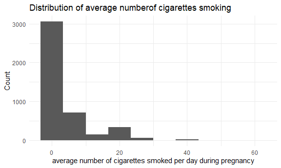
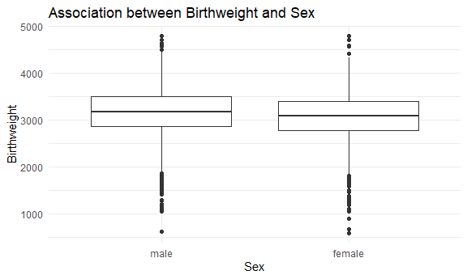
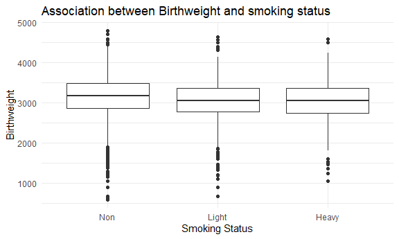
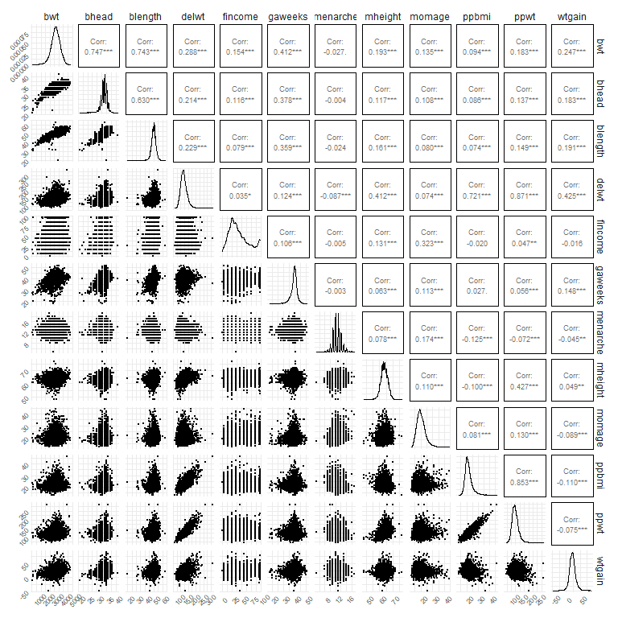
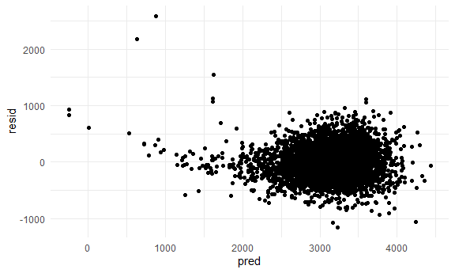
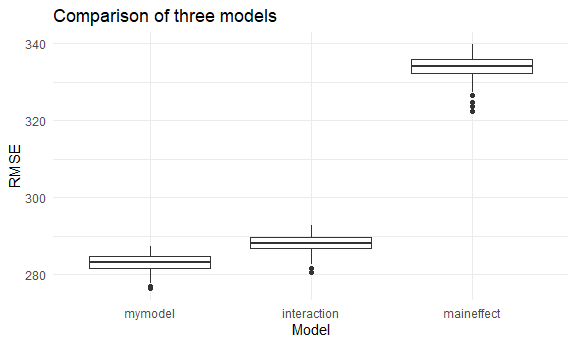

p8105\_hw6\_xy2517
================
Xuehan Yang
2021/12/2

``` r
library(tidyverse)
library(modelr)
library(mgcv)
library(viridis)
library(GGally)

knitr::opts_chunk$set(
  fig.width = 6,
  fig.asp = .6,
  out.width = "90%"
)

theme_set(theme_minimal() + theme(legend.position = "bottom"))

options(
  ggplot2.continuous.colour = "viridis",
  ggplot2.continuous.fill = "viridis"
)

scale_colour_discrete = scale_colour_viridis_d
scale_fill_discrete = scale_fill_viridis_d
```

## Problem 1

Explore the effects of several variables on a child’s birthweight.

### Load and clean data for regression

``` r
bwt_df = read_csv("./data/birthweight.csv") %>% 
  mutate(
    babysex = as_factor(babysex),
    babysex = fct_recode(babysex, "male" = "1", "female" = "2"),
    frace = as_factor(frace),
    frace = fct_recode(frace, "White" = "1", "Black" = "2", "Asian" = "3",
                        "Puerto Rican" = "4", "Other" = "8", "Unknown" = "9"),
    malform = as_factor(malform),
    malform = fct_recode(malform, "absent" = "0", "present" = "1"),
    mrace = as_factor(mrace),
    mrace = fct_recode(mrace, "Whie" = "1", "Black" = "2", "Asian" = "3",
                        "Puerto Rican" = "4", "Other" = "8"))
```

``` r
which(is.na(bwt_df))
```

    ## integer(0)

There is no NA value.

``` r
bwt_df %>% 
  filter(bhead == 0 | blength == 0 | bwt == 0 | delwt == 0 | fincome == 0 | gaweeks == 0 | menarche == 0 | mheight == 0 |
           momage == 0 | ppbmi == 0 | wtgain == 0) %>% 
  knitr::kable()
```

| babysex | bhead | blength |  bwt | delwt | fincome | frace | gaweeks | malform | menarche | mheight | momage | mrace | parity | pnumlbw | pnumsga |    ppbmi | ppwt | smoken | wtgain |
|:--------|------:|--------:|-----:|------:|--------:|:------|--------:|:--------|---------:|--------:|-------:|:------|-------:|--------:|--------:|---------:|-----:|-------:|-------:|
| female  |    33 |      50 | 3515 |   126 |      65 | White |    41.4 | absent  |       15 |      61 |     23 | Whie  |      0 |       0 |       0 | 23.85727 |  126 |      0 |      0 |
| female  |    34 |      47 | 2807 |   150 |      15 | White |    35.9 | absent  |       11 |      64 |     26 | Whie  |      0 |       0 |       0 | 25.80128 |  150 |     20 |      0 |
| female  |    35 |      53 | 3459 |   135 |      55 | White |    42.3 | absent  |       14 |      63 |     31 | Whie  |      0 |       0 |       0 | 23.96418 |  135 |      0 |      0 |
| male    |    33 |      50 | 3033 |   170 |      45 | White |    39.4 | absent  |       13 |      68 |     20 | Whie  |      0 |       0 |       0 | 25.90246 |  170 |      0 |      0 |
| female  |    33 |      48 | 2580 |   155 |      25 | Black |    39.4 | absent  |       13 |      66 |     18 | Black |      0 |       0 |       0 | 25.06996 |  155 |      0 |      0 |
| female  |    32 |      46 | 2013 |   115 |      35 | Black |    36.9 | absent  |       11 |      63 |     13 | Black |      0 |       0 |       0 | 20.41393 |  115 |      0 |      0 |
| female  |    33 |      50 | 2637 |   118 |      45 | Black |    41.3 | absent  |       13 |      63 |     20 | Black |      0 |       0 |       0 | 20.94647 |  118 |      0 |      0 |
| male    |    30 |      47 | 1814 |   189 |       5 | Black |    36.7 | absent  |       11 |      68 |     23 | Black |      0 |       0 |       0 | 28.79744 |  189 |      0 |      0 |
| female  |    27 |      44 | 1644 |   110 |      15 | Black |    32.3 | absent  |       11 |      61 |     18 | Black |      0 |       0 |       0 | 20.82778 |  110 |     10 |      0 |
| male    |    32 |      47 | 2155 |   120 |      25 | White |    39.9 | absent  |       11 |      62 |     22 | Whie  |      0 |       0 |       0 | 21.99418 |  120 |      8 |      0 |
| female  |    35 |      51 | 2920 |   144 |      55 | Black |    40.3 | absent  |       13 |      63 |     21 | Black |      0 |       0 |       0 | 25.56179 |  144 |      0 |      0 |
| female  |    34 |      50 | 3005 |   180 |       5 | White |    40.7 | absent  |       12 |      63 |     20 | Whie  |      0 |       0 |       0 | 31.95224 |  180 |      9 |      0 |
| male    |    33 |      48 | 3005 |   108 |      96 | White |    43.1 | absent  |       11 |      61 |     15 | Whie  |      0 |       0 |       0 | 20.44909 |  108 |      0 |      0 |
| female  |    33 |      49 | 2495 |   163 |       0 | White |    36.7 | absent  |       12 |      64 |     19 | Whie  |      0 |       0 |       0 | 24.08119 |  140 |     20 |     23 |
| male    |    36 |      53 | 3402 |   130 |      25 | White |    41.0 | absent  |       12 |      61 |     19 | Whie  |      0 |       0 |       0 | 24.61464 |  130 |      0 |      0 |
| female  |    32 |      48 | 2778 |   100 |      35 | White |    37.0 | absent  |       13 |      62 |     17 | Whie  |      0 |       0 |       0 | 18.32848 |  100 |     15 |      0 |
| female  |    33 |      52 | 2977 |    95 |      25 | White |    40.4 | absent  |       12 |      63 |     18 | Whie  |      0 |       0 |       0 | 16.86368 |   95 |      8 |      0 |
| female  |    34 |      47 | 2580 |   109 |      25 | White |    35.4 | absent  |       12 |      60 |     17 | Whie  |      0 |       0 |       0 | 21.33211 |  109 |      3 |      0 |
| male    |    33 |      53 | 3118 |   112 |      55 | White |    39.3 | absent  |       13 |      62 |     18 | Whie  |      0 |       0 |       0 | 20.52790 |  112 |     20 |      0 |
| female  |    35 |      49 | 2948 |   110 |      35 | White |    42.4 | absent  |       10 |      64 |     19 | Whie  |      0 |       0 |       0 | 18.92094 |  110 |     20 |      0 |
| female  |    33 |      46 | 2466 |   138 |      25 | Black |    34.6 | absent  |        0 |      68 |     13 | Black |      0 |       0 |       0 | 18.13172 |  119 |      0 |     19 |

As for wt\_gain, it is likely that mother gains no weight during
pregnancy.

As for family income, without any income is also possible.

Menarche should not be zero because it is the mother’s age at menarche.

Parity, pnumlbw, pnumsga these three variables contain two many zeros,
which is not good for regression, so they should not be included in the
model.

``` r
ggplot(bwt_df, aes(x = smoken)) + geom_histogram(bins = 10) +
  labs(
    x = "average number of cigarettes smoked per day during pregnancy",
    y = "Count",
    title = "Distribution of average numberof cigarettes smoking"
  )
```



Because there are so many nonsmokers during pregnancy, I want to
transfer the smoken variable into category.

smoken: smoking status(0 = Non(0), 1 = Light(0-10), 2 = Heavy(10+))

``` r
bwt_df = bwt_df %>% 
  filter(bhead != 0 & blength != 0 & bwt != 0 & delwt != 0 & gaweeks != 0 & menarche != 0 & mheight != 0 & momage != 0 & ppbmi != 0) %>% 
  select(-parity, -pnumlbw, -pnumsga) %>% 
  mutate(
  smoken = case_when(
    smoken == 0 ~ "Non",
    smoken > 0 & smoken <=10 ~ "Light",
    smoken >10 ~ "Heavy"
  )
) %>% 
  mutate(
    smoken = as_factor(smoken),
    smoken = fct_relevel(smoken, c("Non", "Light", "Heavy"))
    ) %>% 
  relocate(bwt, babysex, frace, mrace, malform, smoken) # put categorical variables forward
```

Final data set after cleaning

``` r
head(bwt_df) %>% 
  knitr::kable()
```

|  bwt | babysex | frace | mrace | malform | smoken | bhead | blength | delwt | fincome | gaweeks | menarche | mheight | momage |    ppbmi | ppwt | wtgain |
|-----:|:--------|:------|:------|:--------|:-------|------:|--------:|------:|--------:|--------:|---------:|--------:|-------:|---------:|-----:|-------:|
| 3629 | female  | White | Whie  | absent  | Non    |    34 |      51 |   177 |      35 |    39.9 |       13 |      63 |     36 | 26.27184 |  148 |     29 |
| 3062 | male    | Black | Black | absent  | Non    |    34 |      48 |   156 |      65 |    25.9 |       14 |      65 |     25 | 21.34485 |  128 |     28 |
| 3345 | female  | White | Whie  | absent  | Light  |    36 |      50 |   148 |      85 |    39.9 |       12 |      64 |     29 | 23.56517 |  137 |     11 |
| 3062 | male    | White | Whie  | absent  | Light  |    34 |      52 |   157 |      55 |    40.0 |       14 |      64 |     18 | 21.84508 |  127 |     30 |
| 3374 | female  | White | Whie  | absent  | Light  |    34 |      52 |   156 |       5 |    41.6 |       13 |      66 |     20 | 21.02642 |  130 |     26 |
| 3374 | male    | White | Whie  | absent  | Non    |    33 |      52 |   129 |      55 |    40.7 |       12 |      66 |     23 | 18.60030 |  115 |     14 |

There are total 4341 observations of babies’ weight, with 17 variables.
Variables contain bwt, babysex, frace, mrace, malform, smoken, bhead,
blength, delwt, fincome, gaweeks, menarche, mheight, momage, ppbmi,
ppwt, wtgain

### Propose a regression model

**Potential predictors**

-   babysex: Birth weight has consistently been shown to be higher in
    boys than in girls.(ref1)
-   smoken: Smoking has been shown to affect glucose homeostasis and
    increase the risk for type 2 diabetes mellitus. Further, gestational
    diabetes mellitus (GDM) and smoking are known to influence offspring
    birthweight.(ref2)
-   fincome: A clear graded association between income quintile and low
    birth weight was apparent in the United States(ref3)
-   gaweeks: There was a varied difference of distribution in birth
    weights for gestational age.(ref4)
-   wtgain: Excessive pregnancy weight gain appears to increase birth
    weight(ref5)
-   ppbmi: Women with abnormal pre-pregnancy body mass index are at risk
    for adverse birth weight outcomes.(ref6)
-   ppwt: Women with abnormal pre-pregnancy body mass index are at risk
    for adverse birth weight outcomes.(ref6)
-   bhead: head is a part of birthweight.
-   blength: genrally, longer length bigger weight.
-   mheight: A bigger mom tends to deliver a bigger baby.
-   momage: different ages indicate different health status, which might
    influence the birthweight of baby.

**Look at the relation between birthweight and predictors**

``` r
ggplot(bwt_df, aes(x = babysex, y = bwt)) + 
  geom_boxplot() +
  labs(
    x = "Sex",
    y = "Birthweight",
    title = "Association between Birthweight and Sex"
  )
```



``` r
ggplot(bwt_df, aes(x = smoken, y = bwt)) + 
  geom_boxplot() +
  labs(
    x = "Smoking Status",
    y = "Birthweight",
    title = "Association between Birthweight and smoking status"
  )
```



Male babies tend to have higher birthweight. Smoking tend to lower the
birthweight of baby.

``` r
corr_df = bwt_df %>% 
  select(-babysex,-frace,-mrace,-malform,-smoken)

ggpairs(corr_df, 
        lower = list(continuous = wrap("points", size = 0.01)), 
        upper = list(continuous = wrap("cor", size = 2.5))) + 
  theme(axis.text.x = element_text(size = 6, angle = 45),
        axis.text.y = element_text(size = 6, angle = 45))
```



We can see there is colinearity between ppbmi and ppwt.(correlation
coefficient &gt; 0.7). So we keep one of them, ppbmi.

Final prediction dataset.

``` r
predict_df = bwt_df %>% 
  select(-frace, -mrace, -malform, -ppwt)
```

**Regression model**

``` r
bwt_mod = lm(data = bwt_df, bwt ~ babysex + smoken + bhead + blength + delwt + fincome + gaweeks + menarche + mheight + momage + ppbmi + wtgain)
bwt_mod %>% broom::tidy() %>% knitr::kable(digits = 3)
```

| term          |  estimate | std.error | statistic | p.value |
|:--------------|----------:|----------:|----------:|--------:|
| (Intercept)   | -6723.825 |   670.820 |   -10.023 |   0.000 |
| babysexfemale |    30.766 |     8.630 |     3.565 |   0.000 |
| smokenLight   |   -31.895 |     9.802 |    -3.254 |   0.001 |
| smokenHeavy   |   -59.348 |    13.005 |    -4.564 |   0.000 |
| bhead         |   134.247 |     3.505 |    38.303 |   0.000 |
| blength       |    77.296 |     2.054 |    37.632 |   0.000 |
| delwt         |     0.318 |     2.631 |     0.121 |   0.904 |
| fincome       |     0.984 |     0.175 |     5.640 |   0.000 |
| gaweeks       |    12.448 |     1.487 |     8.373 |   0.000 |
| menarche      |    -6.059 |     2.972 |    -2.039 |   0.042 |
| mheight       |    11.195 |    10.481 |     1.068 |   0.286 |
| momage        |     4.486 |     1.197 |     3.748 |   0.000 |
| ppbmi         |     4.112 |    15.163 |     0.271 |   0.786 |
| wtgain        |     3.707 |     2.661 |     1.393 |   0.164 |

Delete the insignificant variables, delwt, mheight, ppbmi, wtgain

``` r
bwt_mod = lm(data = bwt_df, bwt ~ babysex + smoken + bhead + blength + fincome + gaweeks + menarche + momage)
bwt_mod %>% 
  broom::tidy() %>%
  select(term, estimate, p.value) %>% 
  mutate(
    term = str_replace(term, "smoken", "smo_status: "),
    term = str_replace(term, "babysex", "sex: ")) %>% 
  knitr::kable(digits = 3)
```

| term               |  estimate | p.value |
|:-------------------|----------:|--------:|
| (Intercept)        | -6147.235 |   0.000 |
| sex: female        |    32.870 |   0.000 |
| smo\_status: Light |   -23.820 |   0.017 |
| smo\_status: Heavy |   -46.924 |   0.000 |
| bhead              |   138.144 |   0.000 |
| blength            |    81.186 |   0.000 |
| fincome            |     1.042 |   0.000 |
| gaweeks            |    13.322 |   0.000 |
| menarche           |    -6.980 |   0.019 |
| momage             |     4.287 |   0.000 |

All the predictors are significant. Adjusted R square is 0.69426, which
means 69.4% variation in birthweight can be explained by predictors.
Female babies are on average 32.87 grams heavier than male babies. Each
centimeter increase in baby’s head is associated with 138.1 grams
increase in birthweight. Birthweights of baby delivered by lightsmokers
and highsmokers during pregnancy are on average 23.8 grams and 46.9
grams less than nonsmokers.

**Diagnostic**

``` r
bwt_df %>% 
  modelr::add_predictions(bwt_mod) %>% 
  modelr::add_residuals(bwt_mod) %>% 
  ggplot(aes(x = pred, y = resid)) + geom_point()
```



There are some potential outliers on the left. And it seems there exists
heteroscedasticity as the variance of resid increase with hte rising of
predicted birthweight.

**Compare with other two models**

``` r
cv_df = 
  crossv_mc(bwt_df,100)

cv_df = 
  cv_df %>% 
  mutate(
    train = map(train, as_tibble),
    test = map(train, as_tibble)
  ) %>% 
  mutate(
    bwt_mod = map(train, ~lm(bwt ~ babysex + smoken + bhead + blength + fincome + gaweeks + menarche + momage, data = .x)),
    model_2 = map(train, ~lm(bwt ~ blength + gaweeks, data = .x)),
    model_3 = map(train, ~lm(bwt ~ bhead + blength + babysex + bhead*blength + bhead*babysex + blength*babysex, data = .x))
  ) %>% 
  mutate(
    rmse_mymodel = purrr::map2(bwt_mod, test, ~rmse(model = .x, data = .y)),
    rmse_maineffect = purrr::map2(model_2, test, ~rmse(model = .x, data = .y)),
    rmse_interaction = purrr::map2(model_3, test, ~rmse(model = .x, data = .y))
  )
```

``` r
cv_df %>% 
  select(starts_with("rmse")) %>% 
  unnest(cols = c(rmse_mymodel, rmse_maineffect, rmse_interaction)) %>% 
  pivot_longer(
    everything(),
    names_to = "model",
    values_to = "rmse",
    names_prefix = "rmse_"
  ) %>% 
  mutate(model = fct_reorder(model, rmse)) %>% 
  ggplot(aes(x = model, y = rmse)) + geom_boxplot() +
  labs(
    x = "Model",
    y = "RMSE",
    title = "Comparison of three models"
  )
```



Model 1 has the minimum rmse, so I pick model 1 as the final model for
prediction.

## Reference

1.Van Vliet, Guy; Liu, Shiliang; Kramer, Michael S. Decreasing Sex
Difference in Birth Weight, Epidemiology: July 2009 - Volume 20 - Issue
4 - p 622 doi: 10.1097/EDE.0b013e3181a82806

2.Masalin, S, Kautiainen, H, Gissler, M, Pennanen, P, Eriksson, JG,
Laine, MK. Impact of smoking on gestational diabetes mellitus and
offspring birthweight in primiparous women. Acta Obstet Gynecol Scand.
2020; 99: 1632– 1639. <https://doi.org/10.1111/aogs.13924>

3.Melissa L. Martinson and Nancy E. Reichman, 2016: Socioeconomic
Inequalities in Low Birth Weight in the United States, the United
Kingdom, Canada, and Australia American Journal of Public Health 106,
748\_754, <https://doi.org/10.2105/AJPH.2015.303007>

4.Jean Dupont Kemfang Ngowa, Irénée Domkam, Anny Ngassam, Georges
Nguefack-Tsague, Walter Dobgima Pisoh, Cyrille Noa, Jean Marie Kasia,
“References of Birth Weights for Gestational Age and Sex from a Large
Cohort of Singleton Births in Cameroon”, Obstetrics and Gynecology
International, vol. 2014, Article ID 361451, 8 pages, 2014.
<https://doi.org/10.1155/2014/361451>

5.Ludwig DS, Currie J. The association between pregnancy weight gain and
birthweight: a within-family comparison. Lancet. 2010;376(9745):984-990.
<doi:10.1016/S0140-6736(10)60751-9>

6.Zhao R, Xu L, Wu ML, Huang SH, Cao XJ. Maternal pre-pregnancy body
mass index, gestational weight gain influence birth weight. Women Birth.
2018 Feb;31(1):e20-e25. doi: 10.1016/j.wombi.2017.06.003. Epub 2017 Jul
14. PMID: 28716548.
